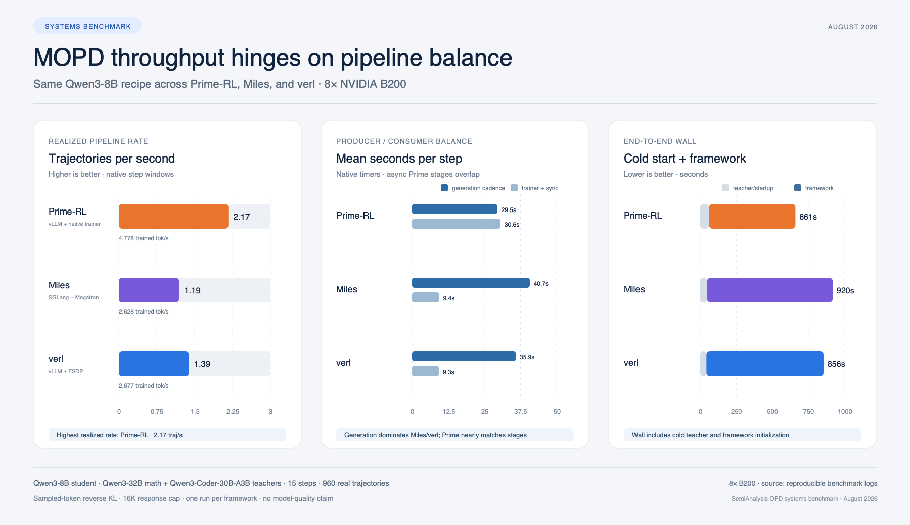

# Full-size MOPD framework benchmark on 8×B200

## Result

Prime-RL delivered the highest realized pipeline rate on this workload: 2.17
real trajectories/s, versus 1.39 for verl and 1.19 for Miles. Its 661-second
end-to-end run was 23% shorter than verl and 28% shorter than Miles. This is a
systems result, not a model-quality result: Prime obtains that rate with an
asynchronous queue and reached five updates of policy staleness, while Miles and
verl remained synchronous.

| Framework | Native topology | End-to-end wall | Pipeline rate | Trained tokens/s | Steady median step | Training-window energy |
|---|---|---:|---:|---:|---:|---:|
| Prime-RL | 2 trainer + 4 vLLM rollout + 2 teachers | **661 s** | **2.17 traj/s** | **4,778** | **20.6 s** | **507 Wh** |
| Miles | 2 Megatron trainer + 4 SGLang rollout + 2 teachers | 920 s | 1.19 traj/s | 2,628 | 45.5 s | 654 Wh |
| verl | 6 hybrid FSDP/vLLM + 2 teachers | 856 s | 1.39 traj/s | 2,677 | 46.9 s | 687 Wh |

The rate divides 960 real trajectories by the sum of each framework's native
step windows. End-to-end wall includes teacher startup and framework cold start.
Energy integrates one-second GPU power samples from training start to framework
exit, excluding teacher startup. These definitions prevent setup time from
being silently mixed into steady-state throughput.

## Matched recipe

The experiment ports the full model topology from Miles' pinned
[Qwen3-8B multi-teacher OPD example](https://github.com/radixark/miles/blob/862ac1ea1fba864171b006d45e0d5e92ff008c6a/examples/on_policy_distillation/run-qwen3-8B-opd-multi-teacher.sh)
to all three frameworks:

| Item | Common setting |
|---|---|
| Student | Qwen3-8B, BF16 |
| Teachers | Qwen3-32B math; Qwen3-Coder-30B-A3B-Instruct code |
| Data | 128 GSM8K + 128 HumanEval training prompts; one routed specialist per row |
| Run shape | 15 optimizer steps; 16 prompts × 4 rollouts = 64 real trajectories/step |
| Sequence limits | 1,024 prompt tokens; 16,384 response tokens |
| Sampling | temperature 1.0, top-p 1.0, no top-k truncation |
| Optimizer | AdamW; LR 1e-6; betas 0.9/0.98; weight decay 0.1; grad clip 1.0 |
| Objective | sampled-token reverse KL (`k1`); task reward disabled |
| Hardware | one detected 8×NVIDIA B200 node, 183,359 MiB/GPU, NV18 all-to-all |

All frameworks used the same immutable model revisions, prompt pools, token-ID
contract, optimizer settings, physical teacher GPUs, and 960 real samples. The
code teacher's tokenizer JSON was not byte-identical, but the validator proved
that the complete vocab-to-ID map, added vocab, special IDs, and representative
encodings were identical across all three models.

There are two intentional framework accommodations. Miles uses its `fused`
trainer attention backend because its example-default `flash` path hung during
B200 backward. verl's six-way FSDP data parallelism cannot divide 64 rows; its
native balancing path pads each optimizer batch from 64 to 72 with eight
two-token, zero-loss rows. Those synthetic rows are excluded from trajectory
counts, and an included 11-line patch correctly clears their ragged MOPD teacher
fields.

## Where the time went

The experiment follows the producer/consumer framing in SemiAnalysis'
[RL systems benchmark](https://newsletter.semianalysis.com/p/rl-systems-mind-the-gap-matching):
student generation produces trajectories, while teacher scoring and the trainer
consume them.

### Prime-RL: asynchronous overlap wins, but broadcasting is expensive

Prime's native pipeline cadence averaged 29.5 s. Its trainer spent 14.9 s per
step in forward/backward and another 15.7 s broadcasting weights through the
filesystem. The complete trainer step averaged 35.6 s, including 5.0 s waiting
for a batch. Producer and consumer were therefore close enough to overlap well,
and the rollout GPUs averaged 60.7% utilization.

That speed is not free. The generator reached a worst observed policy staleness
of five updates. The benchmark does not establish whether this changes long-run
quality, and Prime's filesystem broadcast wrote roughly 16 GB per retained
8B checkpoint. Those generated broadcasts were validated and removed before
collection.

### Miles: the trainer mostly waits for generation

Miles generation averaged 40.7 s per step. The active consumer path was much
shorter: 1.66 s for teacher log probabilities, 1.33 s for student log
probabilities, 5.50 s for actor training, and 0.92 s for weight update. Trainer
wait time averaged 44.9 s and trainer GPU utilization only 15.3%, compared with
41.7% on the four rollout GPUs.

This is the clearest role-imbalance result. On this long-response recipe, adding
trainer capacity would not improve throughput; the producer needs more capacity
or a different allocation first.

### verl: hybrid workers improve balance, but generation still dominates

verl generation averaged 35.9 s, versus 1.32 s for old-policy log probabilities,
3.30 s for actor update, and 4.66 s for weight synchronization. Its six hybrid
GPUs averaged 47.6% utilization and 14.8% native actor MFU. At 1.39 trajectories/s
it was 16% faster than Miles, although its 856-second end-to-end wall was only 7%
shorter because startup and shutdown costs remain material in a 15-step run.

## Teacher capacity was heavily underused

Each framework trained 960 routed trajectories. Miles and verl produced an
exact 480/480 math/code split; Prime's consumed batches produced 484/476.
Prime's asynchronous teacher endpoints logged 1,036 successful scoring calls,
76 more than the trainer consumed. That 7.9% overrun is consistent with queued
or in-flight producer work at the 15-step stop and is not counted as trained
throughput. Miles and verl each logged exactly 960 scored rows after excluding
one startup call per endpoint.

Despite holding 32B and 30B-A3B models, the dedicated teacher GPUs averaged only
3.2–5.6% utilization during framework execution. Each row reaches only one
specialist, scoring is short relative to autoregressive student generation, and
the dedicated servers spend most of the run idle.

This is the strongest next optimization target after generation: batch teacher
requests more aggressively, colocate teachers where memory permits, or allocate
less than two full GPUs to teacher service. A routing-skew sweep is necessary
before doing this in production; a 90/10 domain mix can turn one specialist into
a hotspot even when the aggregate teacher pool looks idle.

## Training validity and non-comparable learning metrics

All three runs completed exactly 15 native optimizer steps and 960 real
trajectories, contacted both teachers, and reported non-zero reverse-KL loss and
gradient norm on every step.

| Framework | Mean sampled reverse-KL estimate | Mean grad norm | Real trained tokens | Mean response tokens |
|---|---:|---:|---:|---:|
| Prime-RL | 0.493 | 4.59 | 2,115,864 | 2,055 |
| Miles | 0.469 | 4.23 | 2,117,007 | 2,056 |
| verl | 0.398 | 3.65 | 1,853,347 | 1,782 |

These values prove that each training path did real work; they do not rank
learning quality. Samples are stochastic, framework loss reductions differ, and
verl generated shorter responses in this one run. A quality comparison requires
multiple seeded runs and common held-out evaluations over a longer convergence
horizon.

verl's native counter included 240 tokens from its documented zero-loss padding
rows; the table and throughput calculation remove those synthetic tokens.

## The software experience is part of the benchmark

The machine was described as 8×B300 but reported eight B200s. Its 193 GB root
filesystem could not hold the models, containers, converted student, and Prime
broadcasts, so the run used a 670 GB executable `/dev/shm` tmpfs. Bring-up then
exposed materially different failure modes:

- Prime-RL's recursive submodules assumed GitHub SSH, its first Triton compile
  needed `python3.12-dev`, and B200 FlashInfer cubins were downloaded at runtime.
  A successful OPD run still printed `Trainable 0/64` because that counter only
  understands reward advantages, not teacher log probabilities.
- Miles' Ray submission WebSocket disconnected while the job remained alive;
  dashboard polling then failed through a stale public endpoint. Directly
  running `train.py` restored reliable lifecycle semantics. Its stock `flash`
  backend later hung in backward with no Python exception, while `fused`
  completed.
- verl first failed resource-pool validation, then failed on an unpinned
  Accelerate/Transformers interaction, then on 64 not dividing six DP ranks,
  then because stock padding cloned ragged teacher fields. After the valid full
  run reached 15/15, teardown still printed a DataLoader-worker traceback even
  though final metrics and successful exit followed.

Every failed attempt, warning stream, workaround, and post-run artifact error is
retained in [SOFTWARE_EXPERIENCE.md](SOFTWARE_EXPERIENCE.md) and
`results/all-runs/`. A clean final command without that history would
substantially misrepresent the engineering cost.

## What to test next

The collected metrics point to a small, useful follow-up matrix:

1. Sweep actor/rollout allocation while holding all models and 64 trajectories
   fixed. Miles should move trainer GPUs toward rollout; Prime should test
   whether faster broadcast changes the matched point.
2. Sweep response caps at 2K, 8K, and 16K and report p50/p95/p99 generation
   latency. The current mean hides straggler sensitivity.
3. Sweep routing mixes at 50/50, 90/10, and bursty domains to measure specialist
   queueing and determine whether teachers can safely be packed.
4. Extend to at least 100 updates and evaluate common checkpoints. This tests
   whether Prime's throughput advantage survives policy staleness and whether
   the frameworks converge comparably.
5. Repeat with three seeds. One run is enough to expose systems anatomy and
   software failures, but not enough for confidence intervals or quality claims.

## Reproduce and audit

The [replication guide](REPLICATION.md) starts from a clean node and includes
setup, pinned revisions, smoke tests, detached execution, validation, cleanup,
download, analysis, and chart commands. `setup_remote_full.sh` is the complete
setup script; `run_all_full.sh` and the three framework launchers are the exact
measured commands. `results/summary.json` is regenerated from native logs by
`analyze_full_results.py`.

The downloadable artifact contains logs, configs, environment manifests, GPU
samples, failed attempts, analysis code, and charts. It contains no base-model
weights, converted model, checkpoint, broadcast weights, or model cache.
