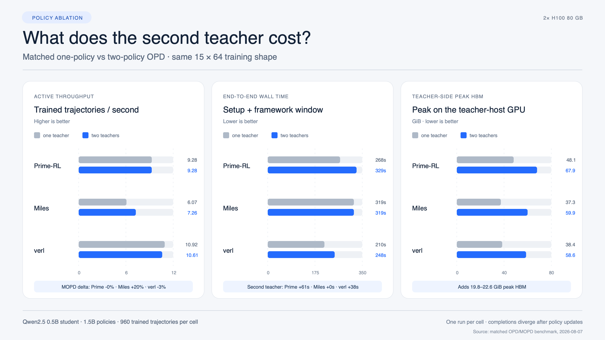
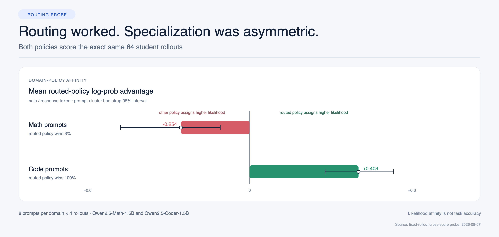

# What else to test in OPD/MOPD: teacher-count and routing ablations

Test date: 2026-08-07. These tests extend the same two-H100 benchmark recipe
used in `REPORT.md`. They ask two narrower questions:

1. What systems cost appears when one physical teacher becomes two?
2. Do the selected domain policies actually exhibit domain-specific affinity on
   the same student rollouts?

## Test 1: matched one-teacher OPD versus two-teacher MOPD



The one-teacher arm retains the same student, math/code prompt mixture, 15
steps, 64 trajectories per step, optimizer, loss, token limits, and nominal
seed. Both logical routes point to the one physical math-policy endpoint. The
two-teacher arm routes math to Qwen2.5-Math-1.5B and code to
Qwen2.5-Coder-1.5B.

This isolates systems footprint, not model quality: the one-teacher arm changes
the policy used for code prompts.

| Framework | Active trajectories/s, 1 → 2 | Steady median step, 1 → 2 | Teacher setup, 1 → 2 | Framework wall, 1 → 2 | Total wall, 1 → 2 | Teacher-side peak HBM, 1 → 2 |
|---|---:|---:|---:|---:|---:|---:|
| Prime-RL | 9.28 → 9.28 | 5.53 → 5.49 s | 62 → 123 s | 206 → 206 s | 268 → 329 s | 48.1 → 67.9 GiB |
| Miles | 6.07 → 7.26 | 10.63 → 8.68 s | 29 → 57 s | 284 → 256 s | 319 → 319 s | 37.3 → 59.9 GiB |
| verl | 10.92 → 10.61 | 4.904 → 4.901 s | 28 → 59 s | 182 → 189 s | 210 → 248 s | 38.4 → 58.6 GiB |

The most repeatable-looking cost is capacity, not steady-state latency. The
second 1.5B policy raised peak memory on the GPU hosting teachers by 19.8–22.6
GiB in every stack. Because the launchers load the endpoints sequentially,
teacher setup also approximately doubled.

Prime-RL's active loop and framework wall were unchanged; its extra 61 seconds
landed entirely in teacher startup. verl's steady median step was also
effectively unchanged, while its total wall rose by 38 seconds. Miles finished
the two-teacher active window 26 seconds sooner, enough to offset its additional
28 seconds of startup.

The Miles throughput delta should not be read as a clean causal speedup from a
second endpoint. This is one run per cell, and the policies diverge after the
first update. Miles' one-teacher responses averaged 210.2 tokens versus 191.8
with two teachers; verl similarly changed from 204.8 to 192.7. Fixed-output
serving tests or repeated seeds are needed to separate endpoint parallelism,
sequence-length variation, and runtime noise.

Training-window energy was 15.46 → 15.47 Wh for Prime-RL, 20.16 → 18.05 Wh for
Miles, and 13.39 → 13.63 Wh for verl. Those integrations exclude teacher cold
start, so they should be interpreted alongside framework wall time.

## Test 2: fixed-rollout cross-scoring



The initial Qwen2.5-0.5B student generated one benchmark-sized batch: eight
math and eight code prompts, four rollouts each, temperature 1.0, and at most
256 response tokens. Both teacher policies then scored every response token.
The plotted value is the routed policy's mean log-probability minus the other
policy's, averaged per trajectory; intervals resample the eight prompt
clusters 10,000 times.

| Domain | Trajectories / tokens | Routed-policy advantage | Prompt-cluster 95% interval | Routed policy wins | Sampled reverse KL: routed / other |
|---|---:|---:|---:|---:|---:|
| Math | 32 / 6,728 | **−0.254 nats/token** | [−0.477, −0.108] | 1 / 32 (3.1%) | 0.485 / 0.232 |
| Code | 32 / 4,803 | **+0.403 nats/token** | [+0.280, +0.534] | 32 / 32 (100%) | 0.153 / 0.557 |

The code route has a clear affinity signal: the code policy assigns higher
likelihood to every code rollout. The nominal math specialist does not show the
same behavior; the code policy assigns higher likelihood to 31 of 32 math
rollouts. The result is not caused only by a five-token math outlier: weighting
all tokens gives −0.151 nats/token for math and +0.357 for code.

This does **not** show that the code checkpoint solves math better. Sequence
likelihood is not task accuracy. It does show that checkpoint labels are not
enough to validate an MOPD routing design: for the exact sampled-token reverse-KL
signal used in training, this policy pair has asymmetric domain affinity.

## What to test next

The highest-value follow-ups are:

- Repeat each OPD/MOPD cell at least three times and report medians and ranges.
- Replay fixed token sequences through one endpoint versus two to isolate
  scoring concurrency from changing response lengths.
- Measure pre/post-training GSM8K and HumanEval pass rates for fixed routing,
  one-policy OPD, and a learned or affinity-gated route.
- Sweep teacher count, teacher size, response length, and top-k distillation;
  the current `top_k=0` result does not predict top-k communication cost.
- For Prime-RL, sweep asynchronous staleness/prefetch depth and report both
  throughput and downstream task quality.

## Reproduction and evidence

Run the one-teacher suite with:

```bash
TEACHER_MODE=single STEPS=15 RUN_ID=opd-matched \
  BENCH_ROOT=/root/opd-bench \
  bash /root/opd-bench/artifacts/mopd-frameworks/run_all.sh
```

Run the fixed-rollout probe inside the Miles container with:

```bash
BENCH_ROOT=/root/opd-bench RUN_ID=routing-full \
  bash /root/opd-bench/artifacts/mopd-frameworks/run_routing_probe.sh
```

`compare_opd_mopd.py` regenerates `results-opd-vs-mopd.json`, and
`generate_ablation_charts.py` regenerates both SVG charts. Raw compact logs and
machine-readable records are under `results-opd/`, `results/`, and
`results-routing-probe/`.
