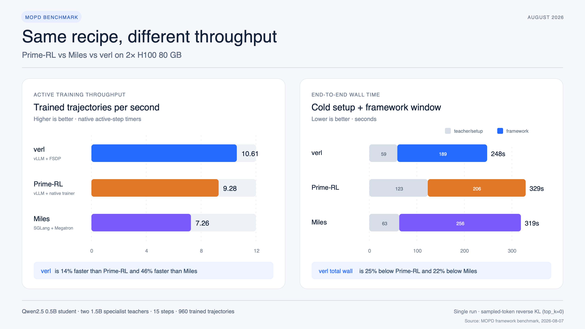

# MOPD framework benchmark: Prime-RL vs Miles vs verl

Test date: 2026-08-07. All three systems completed 15 real optimizer steps on the
same 2x H100 host. This is a systems microbenchmark of multi-teacher on-policy
distillation, not a model-quality evaluation.

## Result

verl was fastest in this run. It processed 10.61 trained trajectories/s during
the active step window, 14% more than Prime-RL and 46% more than Miles. It also
had the shortest measured framework wall time and the lowest energy use during
that window.

| Framework | Active step time | Median step | Trajectories/s | Tokens/s | Framework wall | Total wall incl. teachers | Training-window energy |
|---|---:|---:|---:|---:|---:|---:|---:|
| verl | **90.5 s** | **4.90 s** | **10.61** | **3,619** | **189 s** | **248 s** | **13.63 Wh** |
| Prime-RL | 103.5 s | 6.70 s | 9.28 | 3,226 | 206 s | 329 s | 15.47 Wh |
| Miles | 132.3 s | 8.68 s | 7.26 | 2,476 | 256 s | 319 s | 18.05 Wh |

“Active step time” is the sum of each framework's native per-step timer. The
framework wall starts after both teachers are healthy but includes actor/policy
initialization and shutdown. Total wall also includes sequential cold-start of
the two teachers. Energy is integrated from one-second `nvidia-smi` samples over
the framework window on both GPUs; it excludes teacher cold-start.

## Did MOPD actually run?

Yes. Task reward was fixed at zero in all three systems, while every framework
reported a non-zero distillation loss and non-zero gradient norm for all 15
updates. The specialist endpoints were independently observed, not inferred
from configuration alone.

| Framework | Trained math/code routes | Teacher endpoint requests | Reverse-KL estimate, first → mean → final | Mean / max pre-clip grad norm |
|---|---:|---:|---:|---:|
| Prime-RL | 476 / 484 | 536 / 530 | 0.299 → 0.241 → 0.142 | 9.31 / 11.75 |
| Miles | 480 / 480 | 481 / 481 | 0.255 → 0.227 → 0.133 | 11.12 / 34.98 |
| verl | 480 / 480 | 481 / 481 | 0.208 → 0.235 → 0.219 | 8.34 / 9.68 |

Miles and verl each issued exactly 480 routed requests per specialist plus one
warmup request. Prime-RL's native weighted source scheduler produced a 49.6/50.4
split. Its asynchronous prefetch path teacher-scored additional trajectories
beyond the 960 that entered optimizer batches, so endpoint requests are higher
than trained routes. Prime's `ref_kl` metric uses the opposite sign; the table
reports `-ref_kl` so all three columns have the reverse-KL direction.

The KL series verifies loss-path execution but is not a quality comparison.
Each framework sampled different stochastic completions, and the native
estimators and update schedules are not numerically identical.

## Common recipe

- Student: `Qwen/Qwen2.5-0.5B-Instruct`
- Math teacher: `Qwen/Qwen2.5-Math-1.5B-Instruct`
- Code teacher: `Qwen/Qwen2.5-Coder-1.5B-Instruct`
- Data pool: 128 GSM8K and 128 HumanEval training prompts, with a 50/50 domain
  target
- 15 steps; 16 prompts and 4 student rollouts per prompt; 64 trajectories per
  step and 960 total
- Prompt/response limits: 1024/256 tokens
- BF16, temperature 1.0, top-p 1.0, seed 42 where exposed
- AdamW, LR 1e-6, betas (0.9, 0.98), weight decay 0.1, gradient clip 1.0
- Sampled-token reverse KL (`k1`), coefficient 1.0; task reward excluded

The student and both teachers have byte-identical tokenizer files:
`sha256:c0382117ea329cdf097041132f6d735924b697924d6f6fc3945713e96ce87539`.
The Miles student checkpoint is a Megatron conversion of the same pinned HF
weights used directly by Prime-RL and verl.

Model revisions are `7ae557604adf67be50417f59c2c2f167def9a775` (student),
`aafeb0fc6f22cbf0eaeed126eff8be45b0360a35` (math), and
`2e1fd397ee46e1388853d2af2c993145b0f1098a` (code). The generator also pins
GSM8K at `740312add88f781978c0658806c59bc2815b9866` and HumanEval at
`7dce6050a7d6d172f3cc5c32aa97f52fa1a2e544`.

The full Miles example uses an 8B student, 32B/30B-A3B teachers, eight GPUs,
16-way top-k logits, and 16K responses. Those models do not fit this 2-GPU host.
This scaled recipe preserves multi-teacher routing and optimizer settings.
`top_k=0` is deliberate: it is the only sampled-token reverse-KL objective with
equivalent semantics in all three libraries.

## Which framework and serving stack was used?

All three training frameworks were tested; there was no shared replacement
trainer.

| Library | Revision | Student generation / training | Specialist teachers |
|---|---|---|---|
| Prime-RL | `ec92686fbceb9375d2155cd05c6e87652bf68441` | Prime native async OPD, vLLM 0.26 | Prime/vLLM endpoints |
| Miles | `862ac1ea1fba864171b006d45e0d5e92ff008c6a` | SGLang 0.5.17, Megatron-Core | SGLang 0.5.17 |
| verl | `2b0fe5158be73b30e749f5c63c1c3b6d5db5d614` | vLLM 0.24, FSDP trainer | External SGLang 0.5.17 adapter |

Stock verl allocates a complete Ray GPU slot to the actor and to each of two
teachers, requiring at least three GPUs. On this 2-GPU machine, the included
opt-in patch keeps verl's native routing, loss, and trainer but sends teacher
log-prob requests to two external SGLang endpoints sharing GPU 1. Prime-RL and
Miles use their native multi-teacher paths without a routing patch.

Prime-RL used its normal asynchronous pipeline and reached a maximum policy
staleness of four updates. Miles and verl were synchronous with zero staleness.
That distinction is part of the observed systems behavior, but means this is
not a controlled comparison of identical scheduling algorithms.

## Hardware and pinned software

- 2x NVIDIA H100 80 GB HBM3; driver 580.126.09
- 80 vCPUs exposed from AMD EPYC 9654; Linux 6.8.0-100-generic
- Prime-RL environment: PyTorch 2.11.0+cu128, CUDA 12.8
- Miles/verl containers: PyTorch 2.11.0+cu130, CUDA 13.0
- Miles image: `radixark/miles@sha256:37b5eac955caa2104690ac8b55ee2d70579d962546f61b208c6a0392d1df15a6`
- verl image: `verlai/verl@sha256:b867883b0dd011363e69ab2ab344922a28c5bd0409e2a324e3ee70fb27ca7543`

## Caveats

This is one short run per framework, with no repetitions or confidence
intervals. The systems use the same prompt pool, tokenizer, models, batch shape,
optimizer, and target domain mix, but their native samplers do not consume an
identical prompt/completion sequence. Prime-RL is asynchronous and slightly
missed the exact 50/50 route count. Framework-specific runtimes and CUDA builds
were retained instead of forcing one dependency stack. No post-training GSM8K
or HumanEval accuracy was measured, and no model-quality ranking should be
inferred.

The machine-readable reduction is in `results/summary.json`; raw framework
logs, endpoint logs, wall clocks, and one-second GPU samples are under
`results/`. `analyze_results.py` regenerates every number in this report.

The matched one-teacher ablation and fixed-rollout cross-score experiment are
reported separately in `OPD_VS_MOPD.md`.
