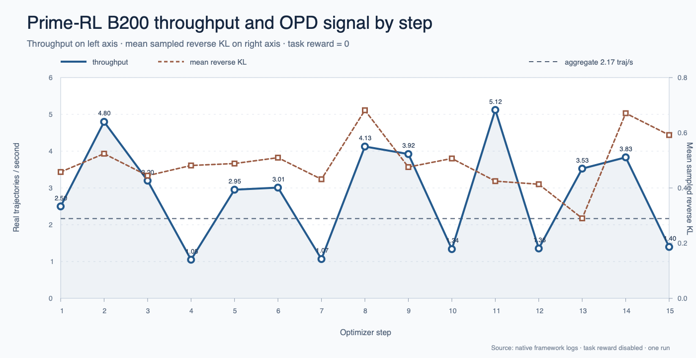
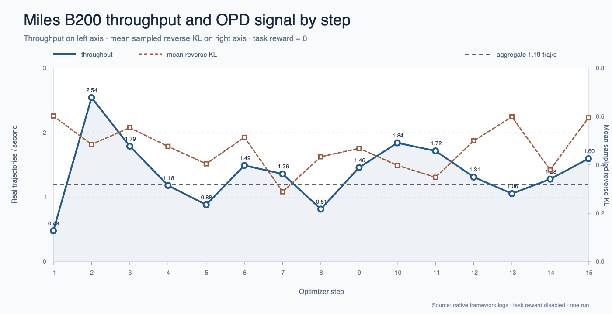
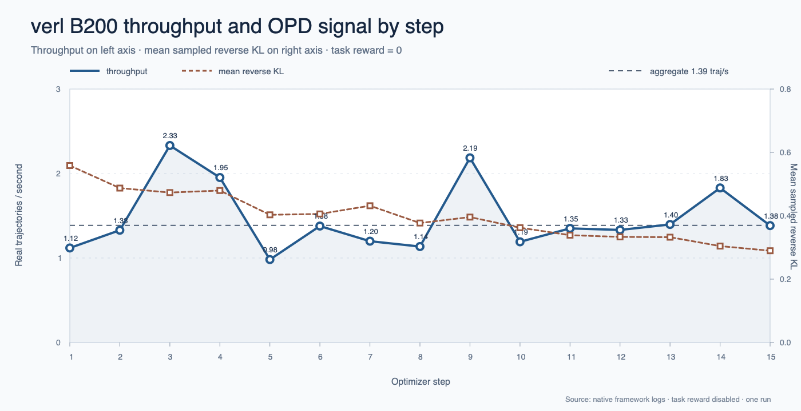

# Case Studies

We ran three experiments to understand how open-source training frameworks
behave when ordinary on-policy distillation becomes multi-teacher on-policy
distillation. Every experiment ran on the same 8×NVIDIA B200 node and used the
same models, data, optimizer, and number of real trajectories. The variable was
the framework and its native system design.

The common recipe used Qwen3-8B as the BF16 student, Qwen3-32B as the math
teacher, and Qwen3-Coder-30B-A3B-Instruct as the code teacher. Training data was
split evenly between GSM8K and HumanEval, with every prompt routed to one
specialist. Each framework completed 15 optimizer steps of 16 prompts × 4
rollouts, for 64 trajectories per step and 960 real trajectories in total. The
response limit was 16,384 tokens and the objective was sampled-token reverse KL
with task reward disabled.

These are systems case studies, not model-quality comparisons. Fifteen steps
are enough to expose pipeline balance, GPU utilization, startup costs, and
failure modes. They are not enough to compare convergence.

## Prime-RL: Async Overlap Wins

### Setup

Prime-RL used two B200s for the trainer, four for vLLM rollout generation, and
two for the teacher endpoints. Its asynchronous orchestrator allowed rollout
generation and training to overlap. The trainer broadcast updated Qwen3-8B
weights back to the rollout workers through the filesystem.

We measured end-to-end wall time from teacher startup through framework exit.
Pipeline throughput counts only the 960 trajectories consumed by the trainer;
teacher requests still in flight when training stopped were not counted as
trained work.

**Configuration**

- **Student:** Qwen3-8B, BF16, FlashAttention 2.
- **Teachers:** Qwen3-32B for math and Qwen3-Coder-30B-A3B-Instruct for code,
  one B200 and one endpoint per teacher.
- **Trainer:** 2 B200s.
- **Generator:** 4 B200s, vLLM data parallelism 4, 70% GPU memory utilization.
- **Batch:** 16 prompts × 4 rollouts, 64 trajectories per optimizer step.
- **Sequence length:** 1,024 prompt tokens + 16,384 completion tokens; 17,408
  tokens maximum.
- **Sampling:** Temperature 1.0, top-p 1.0, no top-k truncation, seed 42.
- **Objective:** Sampled-token reverse KL (`k1`), task reward disabled.
- **Optimizer:** AdamW, learning rate 1e-6, betas 0.9/0.98, weight decay 0.1,
  gradient clipping 1.0.
- **Schedule:** Asynchronous generation and training; filesystem weight
  broadcast; 15 optimizer steps.
- **Reproduction:** [Prime-RL configuration](mopd-b200-full/prime_full.toml) and
  [B200 launcher](mopd-b200-full/run_prime_full.sh).

### Analysis

Prime-RL completed the workload in 661 seconds and delivered 2.17 real
trajectories/s, the highest realized rate of the three B200 runs. It processed
4,778 trained tokens/s and used 507 Wh during the training window.

*Prime-RL real trajectories per second by native optimizer step. Each point is
64 consumed trajectories divided by the orchestrator's step time; the dashed
horizontal line is the aggregate run rate. Task reward is disabled and remains
zero, so the secondary series shows mean sampled reverse KL—the actual OPD
training signal.*

The reason was overlap. Prime-RL's pipeline cadence averaged 29.5 seconds. The
trainer spent 14.9 seconds per step in forward/backward and 15.7 seconds
broadcasting weights, while waiting only 5.0 seconds for a batch. The four
rollout GPUs averaged 60.7% utilization. Generation and training were close
enough in speed that the asynchronous queue kept both sides moving.

The gain came with two costs. First, the worst observed trajectory was five
policy updates stale. The benchmark does not establish whether that degree of
staleness changes long-run model quality, but it is a variable a synchronous
system does not have. Second, the teacher endpoints completed 1,036 scoring
calls even though the trainer consumed 960 trajectories. The extra 76 calls,
or 7.9%, were queued or in flight when the run stopped.

Weight movement was also expensive. Prime-RL spent slightly more time on its
filesystem broadcast than on forward/backward, and every retained 8B BF16
broadcast occupied roughly 16 GB. A faster broadcast path would improve the
matched point between the trainer and generator without increasing staleness.

Prime-RL shows why asynchronous OPD is attractive: it turned the same six
student-side B200s into substantially more pipeline throughput. It also shows
why async performance cannot be reported without policy age, excess generated
work, and weight-update cost.

## Miles: Generation Starves the Trainer

### Setup

Miles assigned two B200s to its Megatron trainer, four to SGLang rollout
generation, and two to the math and code teachers. The pipeline was synchronous:
the trainer waited for each rollout batch, trained on it, and then updated the
generator weights.

The measured run used Miles' `fused` trainer attention backend. The
example-default `flash` backend generated and teacher-scored a complete batch,
then hung during the first B200 backward pass. The model recipe and physical GPU
allocation otherwise remained matched to Prime-RL and verl.

**Configuration**

- **Student:** Qwen3-8B, BF16 Megatron full-weight training.
- **Teachers:** Qwen3-32B math and Qwen3-Coder-30B-A3B-Instruct code, each
  served by SGLang with tensor parallelism 1 on one B200.
- **Trainer:** 2 B200s, Megatron tensor parallelism 2, sequence parallelism,
  full activation recomputation, `fused` attention.
- **Generator:** 4 B200s, four single-GPU SGLang engines, 70% static memory
  fraction.
- **Batch:** 16 prompts × 4 rollouts, global batch size 64.
- **Sequence length:** 1,024 prompt tokens + 16,384 completion tokens.
- **Sampling:** Temperature 1.0, top-p 1.0, top-k 0, seed 42.
- **Objective:** Sampled-token reverse KL with OPD coefficient 1.0; task reward
  disabled.
- **Optimizer:** Adam, constant learning rate 1e-6, betas 0.9/0.98, weight
  decay 0.1, gradient clipping 1.0.
- **Schedule:** Synchronous rollout, scoring, training, and weight update; 15
  optimizer steps.
- **Reproduction:** [Miles B200 launcher](mopd-b200-full/run_miles_full.sh).

### Analysis

Miles completed the run in 920 seconds and delivered 1.19 real trajectories/s,
with 2,628 trained tokens/s and 654 Wh of training-window energy.

*Miles real trajectories per second by native optimizer step. Each point is 64
trajectories divided by framework-reported step time; the dashed line is the
aggregate run rate. Because task reward is identically zero, the secondary
series plots mean sampled reverse KL.*

Generation set the pace. Producing the student trajectories took 40.7 seconds
per step. Once those trajectories arrived, teacher log-probability computation
took only 1.66 seconds, student log probabilities took 1.33 seconds, actor
training took 5.50 seconds, and the weight update took 0.92 seconds. The
consumer was much faster than the producer.

That imbalance appeared directly in utilization. Trainer wait time averaged
44.9 seconds. The two trainer B200s averaged only 15.3% utilization, compared
with 41.7% across the rollout GPUs. The dedicated teacher GPUs averaged just
3.2% utilization.

The Miles case makes the capacity decision unusually clear. More trainer GPUs
would not make this workload faster. The rollout side needs more capacity—or a
faster generation configuration—before the trainer can use additional compute.
It also shows that the large teachers were not responsible for the slowdown.
Scoring the sampled tokens was a small fraction of step time even with a 32B
math teacher and a 30B-A3B code teacher.

## verl: Hybrid Workers Improve Balance

### Setup

verl used six B200s as hybrid FSDP actor and vLLM rollout workers. The remaining
two B200s hosted the same external math and code teachers. Instead of maintaining
separate trainer and generator pools, the six hybrid workers switched roles
inside each synchronous step.

This topology introduced a batch-shape problem. The common batch contained 64
real trajectories, but verl's training data-parallel size was six. Its native
balancer padded each optimizer batch to 72 rows with eight two-token, zero-loss
samples. A small patch cleared `teacher_logprobs` and `teacher_ids` on those
synthetic rows. The analysis excludes the padding rows and their 16 tokens per
step.

**Configuration**

- **Student:** Qwen3-8B, BF16 FSDP with gradient checkpointing and no parameter
  or optimizer offload.
- **Teachers:** Qwen3-32B math and Qwen3-Coder-30B-A3B-Instruct code, each
  served by an external single-B200 SGLang endpoint with tensor parallelism 1.
- **Actor and generator:** 6 hybrid B200s; FSDP actor plus colocated vLLM with
  tensor parallelism 1 and 70% GPU memory utilization.
- **Batch:** 16 prompts × 4 rollouts, 64 real trajectories; mini-batch size 6;
  native balancing pads the optimizer input to 72 rows.
- **Sequence length:** 1,024 prompt tokens + 16,384 completion tokens; 17,408
  tokens maximum.
- **Sampling:** Temperature 1.0, top-p 1.0, no top-k truncation, seed 42.
- **Objective:** Sampled-token reverse KL (`k1`), policy-gradient mode, task
  reward disabled.
- **Optimizer:** AdamW, learning rate 1e-6, betas 0.9/0.98, weight decay 0.1,
  gradient clipping 1.0.
- **Schedule:** Synchronous hybrid rollout and actor update; 15 optimizer
  steps.
- **Reproduction:** [verl B200 launcher](mopd-b200-full/run_verl_full.sh).

### Analysis

verl completed the workload in 856 seconds and delivered 1.39 real
trajectories/s. It processed 2,677 trained tokens/s and used 687 Wh during the
training window.

*verl real trajectories per second by native optimizer step. Each point removes
the eight synthetic padding rows and divides 64 real trajectories by native
step time; the dashed horizontal line is the aggregate run rate. Task reward is
zero by design, so mean sampled reverse KL is shown as the OPD learning signal.*

The hybrid design was better balanced than Miles' fixed two-trainer/four-rollout
split, but generation still dominated. Student generation averaged 35.9 seconds
per step, while old-policy log probabilities took 1.32 seconds, the actor update
took 3.30 seconds, and weight synchronization took 4.66 seconds. The six hybrid
B200s averaged 47.6% utilization and 14.8% native actor MFU.

verl delivered 16% more trajectories/s than Miles, but its end-to-end run was
only 7% shorter. In a 15-step experiment, startup and shutdown were still
material. The first step had to start six vLLM servers, load six FSDP shards,
capture CUDA graphs, and run FlashInfer autotuning.

The case also demonstrates why MOPD data must be treated as more than ordinary
PPO data. A padding helper that was correct for token IDs, masks, and rewards
was incorrect once each sequence carried ragged teacher IDs and teacher log
probabilities. MOPD support is incomplete if routing and scoring work but batch
transformations do not understand the teacher fields.

## What the Three B200 Runs Tell Us

The common bottleneck was student generation, not teacher scoring. Teacher GPU
utilization averaged 5.6% in Prime-RL, 3.2% in Miles, and 3.7% in verl. Miles
and verl each scored an exact 480 math and 480 code trajectories; Prime-RL's
consumed batches split 484/476. With balanced routing, dedicating two full B200s
to the teachers left substantial capacity idle.

The next optimization should be better teacher packing: batch requests more
aggressively, colocate teachers where memory permits, or allocate less than one
full GPU per endpoint. That conclusion must be tested under routing skew. A
90/10 domain mix can overload one specialist even when aggregate teacher
utilization appears low.

All three frameworks completed 15 optimizer steps and reported non-zero
reverse-KL loss and gradient norm on every step. Prime-RL and Miles trained
roughly 2.12 million real tokens each; verl trained 1.85 million because its
sampled responses were shorter. These figures prove that every path performed
real training. They do not rank model quality: the rollouts were stochastic,
the frameworks reduce loss differently, and the experiment used only one run
per system.

# Software User Experience

The final throughput numbers capture only the successful attempts. The failed
runs are equally important because several problems appeared after model
loading, generation, or teacher scoring. We treated a smoke test as successful
only when it contacted both teachers, produced non-zero reverse-KL loss and
gradient norm, ran backward, completed an optimizer update, and exited.

## Prime-RL

Prime-RL's first B200 launch failed when Triton compiled a helper and could not
find `/usr/include/python3.12/Python.h`. Installing `python3.12-dev` fixed the
problem. The Python dependency lock was reproducible, but it did not describe
the complete native build environment.

The next launch downloaded B200 FlashInfer cubins from NVIDIA at runtime. That
first-run network dependency needs to be documented for air-gapped clusters and
excluded from steady-state performance measurements.

Prime-RL also printed `Trainable 0/64 (0.0%)` during successful OPD training.
The counter is tied to non-zero RL advantages. This recipe intentionally had no
task reward and `advantages=None`; the actual training signal lived in teacher
`ref_logprobs`. Non-zero loss, reverse KL, gradient norm, backward time, and
weight broadcasts proved that the rows trained. An RL-specific counter became
actively misleading when the objective changed to OPD.

The final pipeline was the fastest of the three, but its filesystem weight
broadcasts created roughly 16 GB per retained step. Those files had to be
cleaned only after metrics were validated, otherwise a short sequence of smoke
tests could exhaust the benchmark filesystem.

## Miles

Miles' first rough edge was job lifecycle management. A `ray job submit`
WebSocket disconnected while Ray still marked the job as `RUNNING`. The shell
continued as if the submission had finished, and cleanup killed a healthy job.
Polling the Ray dashboard did not solve the problem because the dashboard
advertised a stale public endpoint and returned HTTP 500 and connection-refused
errors.

The reliable path kept Miles' Ray actors but ran `train.py` as the blocking
foreground process. Exit status, signal handling, log streaming, and cleanup
then corresponded to the actual training process.

The more serious failure arrived after a full batch had already been generated
and teacher-scored. Miles' example-default `flash` attention backend hung in
B200 backward for more than 20 minutes without raising a Python exception. The
trainer GPUs showed 100% SM activity, near-zero memory throughput, unusually low
power, and a spinning CPU thread per rank. Restarting the container was required
to terminate the CUDA work. The same recipe completed with the `fused` backend.

Miles also emitted enough non-fatal warnings to obscure useful events. One
Qwen3-ASR `cache_position` message was labeled `ERROR` even though the run did
not use an ASR model. Warning severity is part of usability when operators must
distinguish a slow step from a dead job.

## verl

verl's teacher integration first failed configuration validation. The two
teacher endpoints lived outside the actor's Ray pool, but the distillation
dataclass still required its logical teacher replica count to match the
distillation resource pool. Configuring two logical replicas satisfied the
check while physical GPUs 0–5 remained assigned to actor/rollout and GPUs 6–7
remained assigned to the teachers.

The pinned container then failed during actor construction because its
Accelerate 1.12.0 package was incompatible with Transformers 5.5.3. Accelerate
was allowed to float even though the image digest was pinned. Pinning
Accelerate 1.14.0 fixed the handoff.

Two failures appeared later. The first was the 64-row batch not dividing across
six FSDP ranks. The second came after enabling native padding: the helper copied
ragged teacher fields from a real sample into each synthetic row, so the teacher
log-probability length no longer matched the two-token sequence. Clearing both
teacher fields on the padding rows allowed the next smoke test to complete
routing, reverse KL, backward, and the optimizer update.

The full run still ended with ambiguous output. After the progress bar reached
15/15, Python printed a DataLoader-worker traceback while Ray was tearing down.
The final step-15 metrics, validation message, wall-time record, and successful
suite exit appeared afterward. The result was valid, but a traceback after a
successful run is a poor lifecycle contract for automation.

## Cross-Framework Friction

The 8×B200 node reported 183,359 MiB per GPU, 240 CPUs, and roughly 1.3 TiB of
RAM. Its 193 GB root filesystem was too small for the three models, containers,
Miles' converted checkpoint, and Prime-RL broadcasts. The benchmark therefore
ran from a 670 GB executable `/dev/shm` tmpfs. This made filesystem broadcasts
fast but made all evidence volatile, so logs and metrics had to be copied away
before the node shut down.

Checkout was not frictionless either. Prime-RL's recursive submodules used
SSH-form GitHub URLs, while the node had outbound HTTPS but no configured GitHub
SSH trust. A command-scoped SSH-to-HTTPS rewrite fixed the fetch. An interrupted
retry then left one submodule empty, producing a misleading `uv sync` error
until the pinned worktree was restored.

Tokenizer validation needed semantic checks rather than file hashes. The
student and math teacher had byte-identical `tokenizer.json` files; the code
teacher did not. Nevertheless, all three had the same complete token-to-ID map,
added vocabulary, special IDs, tokenizer sizes, and representative encodings.
That semantic ID equivalence is the relevant contract when teachers score token
IDs sampled by the student.

The larger lesson is that a Git commit or container digest is necessary but not
sufficient. System headers, runtime-downloaded kernels, floating transitive
packages, batch transformation utilities, and launcher exit semantics all
decided whether a real optimizer step completed. A clean final command without
the failed attempts would substantially understate the engineering cost.

The exact launchers, raw logs, failed attempts, and metric definitions are in
the [8×B200 report](mopd-b200-full/REPORT.md), the full
[software-experience record](mopd-b200-full/SOFTWARE_EXPERIENCE.md), and the
[replication guide](mopd-b200-full/REPLICATION.md).
