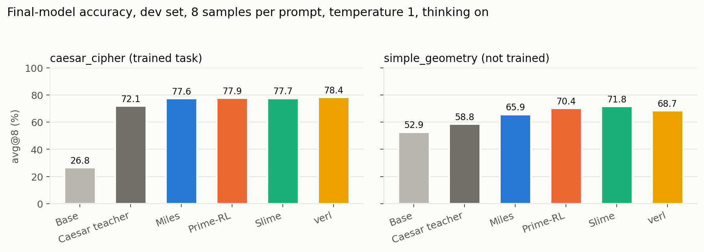
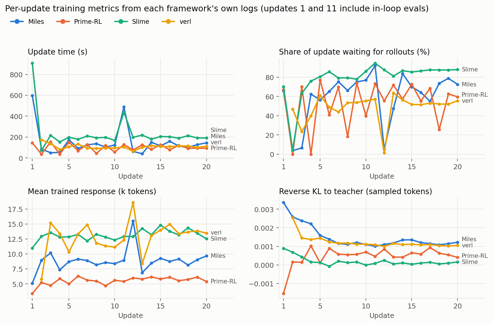
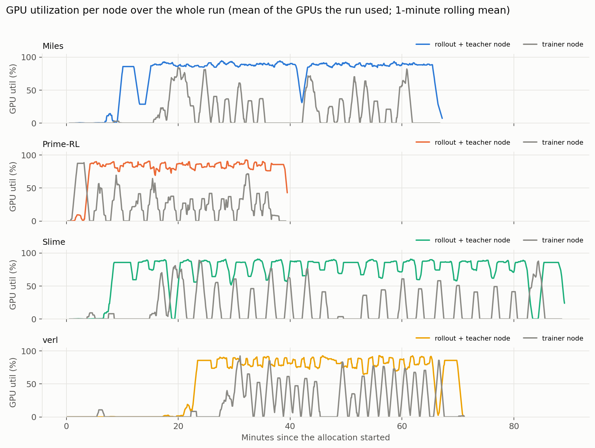

# Single-teacher OPD on caesar_cipher in Miles, Prime-RL, Slime and verl: benchmark and software experience

*Runs of 27 September 2026 (UTC), and the Prime-RL and Miles reruns of 28 September (jobs 1017 and 1021), on two nodes of eight B200 GPUs, driven entirely by this repository's
package (`shared/`, `frameworks/`, `tools/`). Every number here comes from these runs' own logs,
telemetry and benchmark outputs, stored in [`caesar-opd-2026-09-27/data/`](caesar-opd-2026-09-27/data/).*

## Summary

We distilled a frozen `caesar_cipher` teacher into the base Qwen3.6-35B-A3B student with on-policy
distillation (OPD), running the same 20-update recipe in four open RL frameworks. Nothing was tuned per
framework beyond what its own documentation and examples prescribe. Prime-RL's first run (job 968) did not
meet that bar: its config overrode Prime-RL's defaults in seven places. We audited it, reran on upstream's
defaults (job 1017), and report the rerun; the first run is kept for comparison in
[Prime-RL: first run and rerun](#prime-rl-first-run-and-rerun). A fifth framework, NeMo-RL, ran the
same recipe on 28 September but never completed a training update (see [NeMo-RL](#nemo-rl)). Miles was
rerun end to end with `tools/reproduce.sh miles` (job 1021) after the package started logging its training
reward; it reproduced its first run (77.6% against 77.4%), and the Miles numbers below are the rerun's.

| | Miles | Prime-RL | Slime | verl |
|---|---|---|---|---|
| caesar_cipher avg@8 after 20 updates (base 26.8%, teacher 72.1%) | 77.6% | 77.9% | 77.7% | 78.4% |
| simple_geometry avg@8, never trained (base 52.9%) | 65.9% | 70.4% | 71.8% | 68.7% |
| Median time per update | 119 s | 93 s | 197 s | 106 s |
| Share of an update spent waiting for rollouts (median) | 72% | 61% | 84% | 53% |
| Wall time for the whole allocation | 67.5 min | 39.6 min | 89.4 min | 71.3 min |
| Launches until a clean run | 3, then 1 for the rerun | 2, then 3 for the rerun | 1 | 5 |

- **All four students beat their teacher.** Every framework ended 5–6 points above the teacher on the
  held-out caesar set (77.6–78.4%) and solved at least 125 of 126 prompts in eight samples. All four also
  rose 13–19 points on `simple_geometry`, a task no teacher taught them. With one seed per framework, the
  1-point spread between them is noise.
- **Our own config had made Prime-RL look worse.** Prime-RL's first run reached 58.0%. Its config set
  bf16 master weights (through a `model.vlm` block this text-only run does not need), capped concurrency
  and engine sizes, forced the teacher into eager mode and disabled FlashInfer autotune, none of it with a
  recorded reason. On Prime-RL's defaults with the same recipe it reached 77.9% in 40 minutes, the fastest
  of the four (see [Prime-RL: first run and rerun](#prime-rl-first-run-and-rerun)).
- **Generation is the bottleneck in every framework.** With thinking on and up to 30,720 generated
  tokens, trainers spent 53–84% of each update waiting for rollouts. Trainer GPUs averaged 16–25%
  utilization, policy GPUs 62–87%. The frameworks differ mainly in how they handle the long tail of
  30k-token responses: waiting for it (Slime, slowest), dropping it (Prime-RL, fastest), or resuming it
  across weight updates (verl). All three reached the same quality.
- **Most of the effort went into the environment, not the algorithm.** Of the nine failed training,
  benchmark and conversion jobs of 27 September, one hit an upstream incompatibility (verl's legacy bridge against its
  own locked megatron-core); every other failure was a package, environment or cluster issue. They are all listed in
  [Software user experience](#software-user-experience).
- **NeMo-RL did not train.** Eleven launches and 52 GPU-hours on three nodes: seven failed starts
  before its NGC container ran under its own `ray.sub` launcher, then every clean start deadlocked in the
  first trainer-to-vLLM weight sync with all 24 GPUs idle. Running upstream's reference MOPD recipe with
  only the model changed to Qwen3.6-35B-A3B showed why: vLLM rejected the fused MoE expert weights, and
  NeMo-RL's driver kept waiting instead of failing.



## Setup

### The task

| | |
|---|---|
| Student | `Qwen/Qwen3.6-35B-A3B` at revision `995ad96e`, 35B total / 3B active MoE, hybrid linear + full attention |
| Teacher | `semianalysisai/Qwen3.6-35B-A3B-caesar-cipher-GRPO-20260924`, tag `step-125` (`dfedf677`), fused into the base layout with `tools/fuse_teacher.py` |
| Task | reasoning_gym 0.1.25 `caesar_cipher`: 7,788 training prompts, 126 held-out dev prompts |
| Objective | Sampled-token reverse KL to the teacher (each framework's native OPD path); no task reward |
| Updates | 20, 128 prompts × 1 sample each, learning rate 1e-6 constant, Adam β2 0.999, weight decay 0 |
| Lengths | Thinking on; 32,768-token context, up to 30,720 generated tokens |
| Policy lag | At most 1 update (each framework's own staleness control) |
| In-loop evaluation | Greedy on the caesar dev set before training and after updates 10 and 20 (part of every wall time) |

The mode was selected with the package's new `tools/prepare.py --domains caesar_cipher`; with both
domains the same package runs the two-teacher MOPD recipe.

### Hardware and layout

Two exclusive nodes of 8 × B200 (183 GB), Slurm on Kubernetes (slinky), Pyxis/Enroot for containers,
Lustre for `/shared`. Each framework uses one node for the trainer (8 GPUs, expert parallel 8, no
context parallelism) and one for generation: the teacher on GPU 0 (GPU 1 idles with a single teacher)
and the student policy on GPUs 2–7 as three engines of two GPUs.

| | Miles | Prime-RL | Slime | verl |
|---|---|---|---|---|
| Upstream revision | `8f8e4dff` + package patch | `550beb6f` + package patch | `4c193f1f` + package patch | `6093e007`, unmodified |
| Runtime | Container `radixark/miles@sha256:59a11219…` | uv venv from its `uv.lock` | Same container as Miles | uv venv from its `uv.lock`, extras `vllm`+`fsdp` |
| Trainer | Megatron (image: Transformer Engine 2.17, Megatron `8c1e0574`) | FSDP2, custom MoE impl, fp32 master weights, optimizer state offloaded to CPU (defaults) | Megatron (same image) | FSDP (`fully_async_ppo_trainer`) |
| Policy serving | SGLang 0.5.19.dev52, 3 × TP2 | vLLM 0.28.0, 3 × TP2 behind vllm-router | SGLang, 3 × TP2 | vLLM 0.29.0, 3 × TP2 |
| Teacher serving | SGLang prefill-only | vLLM | SGLang prefill-only | vLLM (verl's teacher pool) |
| Scheduling | Fully async, domain-balanced buffer, staleness 1 | Continuous async, `max_off_policy_steps` 1 | `train_async`, one rollout ahead | Fully async, staleness 1, partial rollout |
| Final weights | `--save-hf` export | DCP checkpoint → `tools/convert_dcp_to_bf16.py` | `--save-hf` export | FSDP shards → `verl.model_merger` |

### Benchmark method

`tools/benchmark.py` serves each final model with vLLM 0.29 (one TP1 engine per GPU, eight GPUs) and
samples every dev prompt 8 times at the training sampling settings (temperature 1, top-p 1, thinking on,
up to 30,720 tokens). `shared/scoring.py` scores the text after the last `</think>`, so an answer cut
off mid-thought scores 0. avg@8 is the mean score; pass@8 is the share of prompts solved at least once.
Telemetry comes from the package's `shared/capture.py` (5-second `nvidia-smi`, `/proc` and Prometheus
samples on both nodes) and each framework's own per-update metrics; `tools/report.py` summarizes both.

## Results

### Final-model quality

| Model | caesar avg@8 | caesar pass@8 | finished thinking | truncated | mean response | geometry avg@8 | geometry pass@8 |
|---|---|---|---|---|---|---|---|
| Base | 26.8% | 72.2% | 94.7% | 5.5% | 12.2k | 52.9% | 99.2% |
| Caesar teacher | 72.1% | 98.4% | 95.6% | 4.5% | 12.6k | 58.8% | 99.2% |
| Miles | 77.6% | 99.2% | 94.6% | 5.8% | 13.1k | 65.9% | 99.2% |
| Prime-RL | 77.9% | 99.2% | 94.8% | 5.7% | 13.3k | 70.4% | 100% |
| Slime | 77.7% | 99.2% | 95.8% | 4.6% | 12.7k | 71.8% | 100% |
| verl | 78.4% | 100% | 94.4% | 5.7% | 13.3k | 68.7% | 100% |

Response length and truncation barely moved from the base, so none of the gains come from shorter or
cut-off answers. The teacher itself also scores above the base on geometry (58.8% vs 52.9%), so some
transfer from caesar training to geometry is expected; the students went further than the teacher.

### Training speed



| | Miles | Prime-RL | Slime | verl |
|---|---|---|---|---|
| Median update | 119 s | 93 s | 197 s | 106 s |
| Sum of update times | 50.7 min | 32.5 min | 78.7 min | 34.2 min (19 of 20 logged) |
| Median trainer compute per update | 37 s | 24 s | 29 s | 40 s |
| Median wait for rollouts per update | 85 s | 57 s | 166 s | 56 s |
| Median weight sync | 2.9 s | 11.2 s | 2.9 s | 10.2 s |
| Trainer MFU (mean) | 3.5% | 6.4% (over forward-backward only) | 12.2% (derived, see below) | 5.8% |
| Mean trained response | 8.9k | 5.5k | 13.1k | 12.8k |
| Samples dropped as stale | not logged | 862 | 0 (one rollout ahead, nothing dropped) | 0 (partial rollouts resumed instead) |
| Reverse KL to teacher, update 1 → 20 | 0.0034 → 0.0012 | −0.0015 → 0.0004 | 0.0009 → 0.0002 | 0.0025 → 0.0011 |
| Training-rollout caesar score, first → last | 22% → 85% | 18% → 89% | 20% → 75% | 23% → 79% |

Update 1 includes the pre-training evaluation and warm-up, and update 11 (Miles, Slime) the second
in-loop evaluation, so medians are the fair comparison. Slime logs trainer TFLOPS but no MFU; its value
is `perf/actor_train_tflops` divided by the 2,250 TFLOPS peak Miles records for B200, and Slime's longer
trained sequences account for part of the difference. Each framework computes its logged reverse KL on
different quantities (Slime's is on rollout log-probabilities), so compare trends, not values. verl logs no metrics line for its first update, so its
sums cover 19 updates. Each framework times its phases differently (for example verl's "wait" is its
`timing_s/gen`, Prime-RL's is `time/wait_for_batch`); `tools/report.py` records which metric feeds
each field.

### GPU utilization and energy



| | Miles | Prime-RL | Slime | verl |
|---|---|---|---|---|
| Policy GPUs, mean utilization | 79–86% | 86–87% | 79–84% | 62% |
| Trainer GPUs, mean utilization | 17% | 25% | 16% | 20% |
| Peak memory, trainer / policy GPU | 178 / 133 GB | 74 / 168 GB | 169 / 125 GB | 123 / 147 GB |
| Policy tokens generated (whole run) | 63.6M at 18.0k tok/s | 90.0M at 40.3k tok/s | 41.0M at 8.4k tok/s | not captured |
| Teacher prefill throughput | 14.4k tok/s | 8.9k tok/s | 6.5k tok/s | not captured |
| GPU energy, both nodes | 7.9 kWh | 5.2 kWh | 9.6 kWh | 7.6 kWh |

The trainer node idles most of every update in all four: the sawtooth in the figure is one training
step per update, then a long wait for the next batch. Miles' trainer ran closest to the memory limit
(178 of 183 GB) with no context parallelism at 32k tokens per GPU. verl's first 22 minutes are empty:
its vLLM teacher spent about 15 minutes compiling a FlashInfer MoE kernel with every GPU idle (see
below). Ray placed verl's pools the opposite way round from the package's node roles, so its rollout ran
on the node the site file calls "trainer"; the figure labels nodes by what they ran. The package's verl
capture does not scrape vLLM's metrics endpoints, so verl has no token counters.

### Where the time goes

At these lengths the rollout queue is the whole story. A caesar response averages 12–13k tokens and
the longest reach 30k, generated at a few hundred tokens per second per sequence. Each framework
handles the long tail differently:

- **Miles** waits: its update blocks on a full batch of 128, so the slowest sample sets the pace (72% of
  each update spent waiting).
- **Prime-RL** keeps generating and trains on what finishes first, cancelling or dropping what goes
  stale: 862 samples were dropped, and its trained responses average 5.5k tokens against the 13k the model
  actually writes. With Prime-RL's default concurrency (943 rollouts in flight, sized for its default
  `max_off_policy_steps` of 8) and the recipe's lag of 1, it logs "Discarded 911/1039 episodes (87.7%):
  stale=911 ... Review max_off_policy_steps". Its policy engines still generated the most tokens, 90M at
  40k tokens/s.
- **verl** resumes interrupted samples after each weight sync (partial rollout): nothing is dropped, 44%
  of samples span two policy versions (at update 5), and it trained on the longest responses (12.8k).
- **Slime** generates exactly one rollout ahead and waits for all of it: nothing is dropped and its
  trained responses are the longest (13.1k), but every update waits for its slowest sample (84% of each
  update, 197 s median). Its policy engines generated at 8.4k tokens/s combined, less than half of
  Miles' or Prime-RL's, because each batch ends with a few 30k-token sequences decoding alone (the
  engines logged a single running request at about 280 tokens/s at the end of the first batch).

All four reached the same final quality, including Prime-RL on its shortest, earliest-finishing samples,
so at 20 updates the long tail's handling decides the time, not the result. Slime paid for completeness
with time (89 min, the longest run), verl got it without waiting by resuming partial rollouts, and Prime-RL
was fastest (40 min) by discarding stale rollouts.

### Prime-RL: first run and rerun

Prime-RL's first run (job 968) reached 58.0%, 20 points behind the others, and an earlier version of
this report attributed that to Prime-RL. The cause was the package's config. It overrode Prime-RL's
defaults in seven places, listed in [Prime-RL](#prime-rl) below. We reran with upstream's defaults and
only the shared recipe values set (job 1017), keeping the recipe's policy lag of 1 and weight decay of 0:

| | Job 968 (package overrides) | Job 1017 (upstream defaults) |
|---|---|---|
| caesar avg@8 / pass@8 | 58.0% / 96.0% | 77.9% / 99.2% |
| simple_geometry avg@8 | 58.2% | 70.4% |
| Master weights and gradient reductions | bf16 (forced by `model.vlm`) | fp32 |
| Policy engines | 128 sequences, 8,192 batched tokens, FlashInfer autotune off | vLLM defaults, autotune on |
| Rollouts in flight (max) | 256 | 1,024 (derived start: 943) |
| Policy tokens generated | 59.4M at 20.9k tok/s | 90.0M at 40.3k tok/s |
| Mean trained response / dropped as stale | 9.1k / 751 | 5.5k / 862 |
| Training-rollout caesar score, first → last | 27% → 64% | 18% → 89% |
| Median update / wall time | 105 s / 51.3 min | 93 s / 39.6 min |

The rerun changed everything at once, so which override cost the most points is not isolated. The
precision is the most likely cause. At a learning rate of 1e-6, an update smaller than half a bf16 step
rounds away, and every other trainer here keeps fp32 master weights. Sample selection is ruled out: the
rerun trained on even shorter samples and dropped more of them, yet matched the others.

## Software user experience

Every failure we hit, in order, with its cause and fix. "Package" means this repository's code;
"upstream" means the framework's own code; "cluster" means the environment.

### Miles

Miles was the most self-contained: the pinned upstream launcher plus a digest-pinned container ran the
whole recipe, and its structured logs (`fn=train_actor phase=start/end`, `perf N: {...}` dicts) made
every phase easy to time. Its `--save-hf` flag wrote a complete Hugging Face checkpoint at the save
step, which no other framework offered out of the box.

| # | Symptom | Cause | Fix | Where |
|---|---|---|---|---|
| 1 | Placement check failed silently; the node process aborted 60 s later | The role process imported the image's own Miles (`1e3b7a08`), whose `_create_placement_group` returns a tuple, not the pinned revision's `PlacementGroupInfo` | Put the pinned source first on `sys.path` in the container role | Package |
| 2 | Crash at the first in-loop eval: `No module named 'pycosat'` | `reasoning-gym`'s `pycosat` has no cp312 wheel; installing `pydeps` from the host (Python 3.14) built a 3.14 extension | Install `pydeps` with the container's own Python 3.12 | Package setup |
| 3 | Benchmark load failed: vision weights "not initialized" | The export holds only the language model but keeps the vision-language config | Benchmark with vLLM `language_model_only=True` | Benchmark tool |
| 4 | No training reward in the logs: `rollout/raw_reward` is 0 at every update (job 965) | In OPD, Miles' reward is the teacher's log-probabilities, and the task score is computed only for evaluation | The package's reward hook scores each training sample with the shared verifier and stores it as `metadata["raw_reward"]`, which Miles logs in place of the constant 0 (the OPD loss does not read it); rerun 1021 logs 22% → 85% | Package |

Things we would like upstream: the image's Miles and the pinned source silently diverge; a version check
at start-up would have saved an allocation. The fully-async buffer logs no stale-drop count, so we
could not measure how much Miles discarded.

### Prime-RL

Prime-RL's configuration is the most explicit of the four: a single validated pydantic schema, one
resolved JSON per component, and a `metrics.jsonl` with everything per step. Its documentation answered
every question we had (DCP export, native conversion, OPD configuration).

| # | Symptom | Cause | Fix | Where |
|---|---|---|---|---|
| 1 | `uv sync` failed: `invalid type: boolean false, expected a timestamp string` in `uv.lock` | The lock needs uv ≥ 0.11.1 (`required-version`); we had 0.8.22 | uv 0.11.33 | Environment |
| 2 | Run died in 26 s writing its config | `make_config.py` serialized the recipe dict after `RLConfig.model_validate` had replaced nested dicts with config objects | Write `recipe-input.json` before validating | Package |
| 3 | Conversion job failed | Prime-RL nests `checkpoints/` under `ckpt.output_dir`; our chain pointed one level too high | Correct path | Our scripts |
| 4 | Trainer died at its first step: `DSLRuntimeError` in `flash_attn/cute` (job 1015, the first run on upstream defaults) | Text-only training of this VLM checkpoint freezes the vision encoder but still runs it on dummy pixels every step; with fp32 master weights the encoder is fp32, and `attn='auto'` resolves to FlashAttention 4 on B200, which accepts only bf16/fp16. Upstream switches the encoder to SDPA only under Ulysses CP | Package patch: SDPA for a frozen Qwen3.5 vision encoder whenever text attention is FA4; text attention unchanged | Upstream |
| 5 | Teacher engine died at update 3: `CUDA out of memory. Tried to allocate 8.79 GiB` in `compute_logprobs` (job 1016) | OPD scores each sample with the teacher's prompt logprobs, computed in fp32 over the whole prefill (8.8 GiB for a 9.8k-token sample); vLLM's memory profiling does not reserve it, and at the default `gpu_memory_utilization=0.9` 4 GiB was free | The teacher settings of upstream's OPD example (`configs/debug/algo/opd.toml`): `gpu_memory_utilization=0.5`, `enforce_eager` | Upstream default |

The `.prime-v1` native conversion needs no manual step: the trainer writes it on first load (67 GB, a
few minutes). The package's submit check that demanded it beforehand was removed. The only friction
was uv itself: the version requirement surfaces as a TOML parse error, and the `--no-sync` discipline
the package uses is easy to break by running `uv run` without it.

**Our first Prime-RL run (job 968) did not run Prime-RL's defaults.** The package's config, carried over
from an earlier campaign, overrode seven groups of upstream defaults with no documented reason. Auditing
every resolved setting against a config built from only the required keys found:

| Override in job 968 | Upstream default | What we found | Now |
|---|---|---|---|
| `model.vlm` set, which Prime-RL's validator pairs with `optimization_dtype` and `reduce_dtype` = bf16 | No `model.vlm`; fp32 master weights and reductions | The `vlm` block is for multimodal data. Without it, upstream trains this checkpoint text-only and logs "Training a VLM checkpoint on text-only data; freezing the vision encoder" | Default: fp32 |
| Package source patch: SDPA for a frozen vision encoder under FlashAttention 4, only with `model.vlm` | Unmodified | Text-only training needs it too (job 1015, #4 above) | Extended to text-only training |
| Policy engines: `max_num_seqs=128`, `max_num_batched_tokens=8192`, `gpu_memory_utilization=0.8`, FlashInfer autotune off | vLLM defaults (256 sequences, 16,384 tokens, 0.9), autotune on | The package disabled autotune after a crash, blaming the 32k length. Re-tested on 2 GPUs: autotune crashes with an illegal memory access in `trtllm_bf16_moe` only with `max_num_seqs=128` (a known FlashInfer bug on B200, [flashinfer#4157](https://github.com/flashinfer-ai/flashinfer/issues/4157)); with the default 256 the engine is healthy in 150 s, also with `max_num_batched_tokens=8192` | Defaults, autotune on |
| Teacher engine: eager mode, `gpu_memory_utilization=0.8`, prefix caching off, 128 sequences, 4,096 batched tokens, `language_model_only` | vLLM defaults (CUDA graphs, 0.9, prefix caching on) | At the defaults the teacher ran out of memory (#5 above). Upstream's OPD example starts its teacher with `gpu_memory_utilization=0.5` and `enforce_eager`; the fused teacher has its vision weights | The example's two settings; the rest default |
| Router: `power_of_two`, circuit breaker off, 7,200 s timeout | Upstream's `start_router` arguments: `consistent_hash`, breaker on, 1,800 s | The breaker counts request errors, not slow requests, so the package's reason (long rollouts) did not apply | Upstream arguments |
| Trainer: optimizer CPU offload off, activation offload off, `impl`/`ep` pinned | Both offloads on; `impl`/`ep` auto (resolve to the same custom EP8) | No reason recorded | Defaults |
| Orchestrator concurrency 128 initial / 32 min / 256 max in flight | Derived from the KV cache (943 here), 1 min, 1,024 max | No reason recorded | Defaults |

Kept as recipe values, the same for every framework: 20 updates, 128 prompts × 1 sample, 32,768-token
context, 30,720 response tokens, learning rate 1e-6, weight decay 0 (Prime-RL's default is 0.01), policy lag
1 (`max_off_policy_steps`, Prime-RL's default is 8), thinking on, greedy evaluation every 10 updates. The
two-node layout (three TP2 policy engines, the teacher on one GPU, NCCL weight broadcast) is unchanged.

### verl

verl has the broadest configuration surface, and most of our failures were configuration: its examples
cover each piece we needed (multi-teacher OPD, the fully async trainer, FSDP for MoE) but not the
combination, and several defaults fail silently.

| # | Symptom | Cause | Fix | Where |
|---|---|---|---|---|
| 1 | Node order rejected: `['gpu-nodes-3', 'gpu-nodes-1']` | Slurm lists nodes in its own record order, not alphabetically; the controller compared order | Compare the set of nodes; `srun -w` pins each role | Package |
| 2 | Driver failed at `ray.init` | Ray's `uv run` hook requires the working directory to hold `pyproject.toml` | `RAY_ENABLE_UV_RUN_RUNTIME_ENV=0`; workers already use the venv from `ray start` | Package |
| 3 | Trainer init: `Qwen3_5VLTransformerConfig.__init__() got an unexpected keyword argument` | `vanilla_mbridge=True` (the legacy bridge) is incompatible with the megatron-core in verl's own lock | Moved to FSDP (below) | Upstream/package |
| 4 | Trainer init: `FLA is not installed` | flash-linear-attention is only in the `fsdp` extra, not `megatron` | FSDP with the `vllm`+`fsdp` extras, as in upstream `run_qwen3_8b_mopd_fsdp.sh` | Package |
| 5 | 15 minutes of idle GPUs at start-up | vLLM compiled FlashInfer's TRT-LLM MoE kernel for sm100 with `ninja`/`ptxas` on first use | Prebuilt `flashinfer-cubin` + `flashinfer-jit-cache` (see below) | Environment |

Configuration traps we found by reading verl's source before launch:

- **Multi-teacher entries load random weights.** Teachers added as `+distillation.teacher_models.<name>`
  do not inherit the `teacher_model` YAML entry and fall back to `RolloutConfig` defaults, including
  `load_format: dummy`. Upstream's own MOPD example has this. With one teacher we used the default
  `teacher_model` entry, as in the single-teacher example.
- **Partial rollout off trains truncated samples.** Every weight sync aborts in-flight requests; with
  `partial_rollout=False` they are returned truncated rather than resumed or dropped. We left it on
  (verl's default for this trainer).
- **The teacher's context must be one token longer** than prompt + response
  (`max_model_len = prompt + response + 1`), as the examples compute.
- **Slurm's `ROCR_VISIBLE_DEVICES`** (set by the cluster's GPU plugin alongside `CUDA_VISIBLE_DEVICES`)
  makes every verl worker refuse to start; the package now unsets it.

verl logged the richest per-update metrics (staleness, partial ratio, per-phase timing), but we found
them only in its console log (no TensorBoard files in the run or campaign directories), and it prints
no metrics line for update 1.

### Slime

Slime ran cleanly on its first launch, after one fix found by reading the package before launch. Its
hook interface (custom reward, reward post-processing, sample stamping, train and eval log functions)
let the package record every training and eval sample and every driver phase to JSONL without touching
the trainer, and its `--save-hf` flag wrote the final Hugging Face weights directly. It shares Miles'
container, so it inherited every container fix.

| # | Symptom | Cause | Fix | Where |
|---|---|---|---|---|
| 1 | Would fail at import (found before launch) | The package's `source.patch` imported `record` from a module named `campaign`, renamed to `opd_hooks` | Patch now imports `opd_hooks.record`; manifest hashes updated | Package |

Two things cost time rather than failures. Slime's one-rollout-ahead mode is the simplest to reason
about (policy lag exactly 1, nothing discarded) but the slowest here, because the batch waits for its
longest response. Its metric lines print some values as tensor reprs
(`tensor([0.43], device='cuda:0')`) and it logs TFLOPS but not MFU, so our parser had to unwrap them.
The SGLang engines also print connection-refused tracebacks during warm-up (`freeze_gc`), which are
harmless but look like failures in any log scan.

### NeMo-RL

NeMo-RL (`NVIDIA-NeMo/RL`, pinned at `19244a09` from the NGC container `nvcr.io/nvidia/nemo-rl:v0.7.0`) runs
the same objective as MOPD on its async GRPO trainer, with rollouts through NeMo Gym (which ships a
`reasoning_gym` server, so the task mapped directly). Its documentation separates its two distillation
paths clearly, and its config tree is large but consistent: every key we set was checked against
`grpo_math_1B.yaml` before any GPU time. The layout costs more than the others: MOPD teachers reserve whole
nodes and, with more than one policy node, so does generation, so a 1-GPU teacher still takes a node and the
smallest layout is 24 GPUs (trainer, vLLM, teacher) where the other four use 16. There is no MOPD recipe
for Qwen3.5 or 3.6; we took the algorithm from the MOPD reference recipe (a Qwen3-1.7B self-distillation
smoke test) and the model settings from the Qwen3.5-35B-A3B GRPO recipes.

| # | Symptom | Cause | Fix | Where |
|---|---|---|---|---|
| 1 | Driver failed at once: `uv` "Read-only file system" at `/root/.cache/uv` (job 985) | `ray.sub` starts every container without `--container-writable`, and upstream's flow runs `uv run` in the image | `PYXIS_CONTAINER_WRITABLE=1` (Pyxis' environment form of the flag); earlier attempts at `ray.sub`'s `UV_CACHE_DIR_OVERRIDE`, `--no-sync` and `PYTHONPATH` were removed | Upstream |
| 2 | `uv run` tried to rebuild the editable `nemo_rl` in `/opt/nemo-rl`, also read-only (986) | The image's venv does not contain the project; `uv run` installs it on every launch | Same | Upstream |
| 3 | `No module named 'nemo_rl'` (987) | Our `--no-sync` workaround for #2 | Removed | Package |
| 4 | `cannot import name 'AutoProcessor' from 'transformers' (unknown location)` (988, 995) | The image's venv files are symlinks into its own uv cache; `ray.sub`'s documented `UV_CACHE_DIR_OVERRIDE` mounts over that cache and empties the venv | Do not use the override | Upstream |
| 5 | Ray head never started; 17 GB written to Lustre (994) | We set `HOME` for the whole allocation, and Enroot extracts containers under `$HOME` | Reverted | Package |
| 6 | Every vLLM worker failed: read-only `ray_executor.py.patch_lock` (996) | NeMo-RL patches vLLM's installed files at run time | Same as #1 | Upstream |
| 7 | About 21 minutes per rollout; trainer GPUs spin-waiting (1000) | All upstream Qwen3.5-35B-A3B recipes set `enforce_eager: true` (they generate at most 4k tokens); eager MoE decoding at 30k tokens | CUDA graphs on (the base config's default) | Upstream recipe |
| 8 | Deadlock in the first weight sync, all GPUs idle, no error in the driver log (1001-1003; TP2 and TP1 engines) | In job 1010 (upstream's reference MOPD recipe with the model changed to Qwen3.6-35B-A3B; unbuffered output), at the same call, every vLLM worker logged `shard_dim=0 is not a valid data dimension for a 3D tensor (expected 1 or 2)` for the fused MoE experts; NeMo-RL catches it, returns `False`, and the driver waits on the trainer's broadcast before it checks vLLM's result | **Unresolved** | Upstream |

Two further observations: the `v0.7.0` container is built from `19244a09`, one commit before the `v0.7.0`
tag (the tag only bumps docs and the version string), so the package pins the commit and refuses any other
`NEMO_RL_COMMIT`; and NeMo Gym's `reasoning_gym` server installs an unpinned `reasoning-gym>=0.1.19` at
start-up, which the package pins to 0.1.25 with a uv constraint. The full diagnosis is in
[`nemo-rl-log.md`](caesar-opd-2026-09-27/nemo-rl-log.md), and
[`frameworks/nemo-rl/repro/`](../frameworks/nemo-rl/repro/README.md) reproduces #1, #4 and the container's
provenance in two minutes each on one GPU; `tools/reproduce.sh nemo-rl` reruns #8 with the production
configuration.

### The cluster and environment

| # | Issue | Effect | Resolution |
|---|---|---|---|
| 1 | `gpu-nodes-1`'s `/run/nvidia-persistenced/socket` is a deleted inode (link count 0) | Every Pyxis GPU container fails on that node | Containers avoid it; host-venv frameworks use it. **Needs ops.** |
| 2 | Slurm sets `NVIDIA_VISIBLE_DEVICES=void` for job steps | Containers start without GPUs or driver libraries | `NVIDIA_VISIBLE_DEVICES=all` (the package's container runtime already does this) |
| 3 | Slurm node order is 2, 3, 0, 1, and Miles/Slime require the trainer IP to sort below the generation IP | Only a few node pairs can run the container frameworks | Pair gpu-nodes-0 (generation) with gpu-nodes-2 (trainer) |
| 4 | Host Python is 3.14; the runtimes are 3.12 | Packages with compiled extensions installed from the host are unusable | Install into each runtime with that runtime's Python |
| 5 | FlashInfer JIT on first use; per-job `/tmp` compile caches | Cold compiles cost idle GPU time on every new run | Prebuilt `flashinfer-cubin`/`flashinfer-jit-cache` at the venv's exact `flashinfer-python` version, and one persistent `<campaign>/runtime-cache/` for Triton, Inductor, FlashInfer, vLLM and SGLang |
| 6 | The container image named in the setup guide is not on the cluster | Provenance gap | Used the digest-pinned `radixark/miles@sha256:59a11219…`; its Megatron revision matches the recorded one exactly |

## Cost

GPU-hours from Slurm accounting (elapsed time × GPUs held):

| | GPU-hours |
|---|---|
| Miles first run (965) | 17.0 |
| Prime-RL first run (968) | 13.7 |
| verl training (966), of which ~4 idle in the FlashInfer compile | 19.0 |
| Slime training (979) | 23.8 |
| Failed training attempts (957–962, 967) | 4.4 |
| Final-model benchmarks (969–973, 977, 980) | 7.8 |
| Conversions and GPU/container debugging jobs | 1.3 |
| Prime-RL rerun: training (1017) | 10.6 |
| Miles rerun: training (1021) | 18.0 |
| Miles rerun: runtime set-up and benchmark (1020, 1022) | 1.4 |
| Prime-RL rerun: failed launches (1015, 1016), autotune tests (1011-1014), conversion and benchmark (1018, 1019) | 5.5 |
| NeMo-RL, 11 launches on 24 GPUs (985-1003), no training update | 52.3 |
| NeMo-RL reproduction jobs (1004-1010) | 11.2 |

## Reproducing

```bash
PARTITION=<partition> tools/reproduce.sh all
```

[`tools/reproduce.sh`](../tools/reproduce.sh) runs the whole benchmark with this production setup: models,
containers, conversions and runtimes; then each framework's campaign (`tools/prepare.py <framework>
--domains caesar_cipher`), its Slurm run, the final Hugging Face export and `tools/benchmark.py`; then the base
and teacher benchmarks and `tools/report.py`. Every step is skipped when its output exists, and NeMo-RL's
run is cancelled if its first weight sync has not completed in 20 minutes. Its settings and the site files
it needs are in [setup](SETUP.md#one-command-toolsreproducesh). A resume over these runs
(`NAME=caesar-01`) skipped every step and regenerated `telemetry.json` identically. The Miles rerun (1021) is
`tools/reproduce.sh miles` into a new campaign (`NAME=caesar-02`): preparation, runtime, the run, the Hugging Face
export and the benchmark, unattended. The model downloads, container import and torch_dist conversion were
already present, so those steps have not run from nothing. The charts are rebuilt with `uv run --with matplotlib python docs/caesar-opd-2026-09-27/build_charts.py`.

## Limitations

- One run per framework and one sampling seed per benchmark; differences of a few points are noise.
- Each framework ran in its own documented async mode; "staleness 1" means different things in each
  (see Where the time goes), so speed and quality reflect the mode as much as the implementation.
- In-loop evaluations and start-up are inside every wall time; per-update medians exclude most of it.
- The package code was not frozen: fixes were copied into campaigns between attempts. Each run's
  `launch-source.tar.gz` records the exact code it ran. Prime-RL's reported run (1017) ran a day after the
  others with the audited config; the other three frameworks' configs have not had the same
  line-by-line audit against their defaults.

## Artifacts

On the cluster under `/shared/opd-runs/`: campaigns `<framework>-caesar-01/` and `miles-caesar-02/` (results, logs, captures; NeMo-RL's
runs 985-1003 in `nemo-rl-caesar-01/results/`),
final weights (`miles-caesar-02/checkpoints/miles-1021/hf/iter_19`, the first run's at `miles-caesar-01/checkpoints/miles-965/`,
`slime-caesar-01/checkpoints/slime-979/hf/iter_19`,
`prime-rl-caesar-01/checkpoints/prime-rl-1017/checkpoints/step_20/weights` (the first run's at `prime-rl-968/`),
`verl-caesar-01/checkpoints/verl-966/global_step_20/actor/huggingface-merged`), and `benchmarks/`
(per-response outputs and summaries). In this repository: summaries and telemetry in
[`caesar-opd-2026-09-27/data/`](caesar-opd-2026-09-27/data/), figures and their script in
[`caesar-opd-2026-09-27/`](caesar-opd-2026-09-27/).
