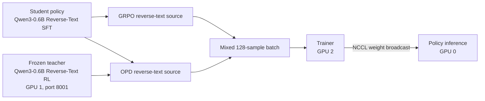

# Mixed GRPO + OPD software experience

This bundle supports the software-experience section of the MOPD/OPD blog. It records a complete 20-step prime-rl run in which GRPO and OPD rollouts share heterogeneous training batches.

## Result in one paragraph

The run completed successfully in 1 minute 29 seconds of orchestrator-loop time. Mixed train reward rose from 0.1703 at step 1 to 0.7763 at step 20. Evaluation reward rose from 0.1035 to 0.8329. The final batch was 75% GRPO and 25% OPD, with per-environment rewards of 0.7639 and 0.8133. No train or eval rollout errors were reported. Final train truncation was 0.8%; final eval truncation was 0.0%.

## System topology



## Reproduction commands

```bash
CUDA_VISIBLE_DEVICES=1 uv run inference \
  --model.name PrimeIntellect/Qwen3-0.6B-Reverse-Text-RL \
  --server.port 8001 \
  --gpu-memory-utilization 0.5 \
  --model.enforce-eager

NCCL_P2P_DISABLE=0 NCCL_SHM_DISABLE=0 CUDA_VISIBLE_DEVICES=0,2 uv run rl \
  @ configs/debug/algo/mixed_grpo_opd.toml \
  --wandb.name mopd-blog-software-experience \
  --output-dir outputs/blog/mopd-software-experience-20260805-1501
```

The NCCL overrides were needed on this host because it has no NVLink. Without them, prime-rl's automatic transport fallback disabled both P2P and shared memory, and the trainer-to-inference broadcaster failed its initial all-reduce.

## What is stored

- `charts/`: publication-ready reward, stability, and throughput plots.
- `metrics/`: per-step CSVs and the complete final summary JSON.
- `configs/`: the source config and every resolved component config.
- `samples/`: representative final-step GRPO and OPD traces.
- `environment.json`: commit, hardware, interpreter, and core package versions.
- `manifest.json`: size and SHA-256 digest for every stored run artifact.
- Parent `logs/`: trainer, orchestrator, inference, and environment logs.
- Parent `run_default/rollouts/`: all and effective trace JSONL files for every step.
- Parent W&B directories: locally cached online-run metadata and media.

## W&B

Online run: https://wandb.ai/joey00072/algorithms-debug/runs/af1d4bdd32dd4e87b082747e38422708

W&B synced five run files, seven media files, and fourteen artifact files.

## Claims safe to make

- GRPO and OPD can coexist in one run and contribute to the same packed training batches.
- OPD uses a separately served frozen teacher while GRPO does not.
- The run improved reverse-text reward quickly over 20 steps and completed with zero rollout errors.
- Dense OPD and scalar-reward GRPO signals were routed through the same trainer without a type/packing failure.

This single debug run does not establish that mixed training outperforms GRPO-only or OPD-only training. A comparative claim requires controlled baselines and multiple seeds.

## Notable stability observation

Gradient norm briefly spiked to 339.2741 at step 8 and 248.9664 at step 20. The run did not produce NaNs or crash, and final eval remained strong. This is worth showing as operational evidence that successful completion does not imply perfectly smooth optimization.
